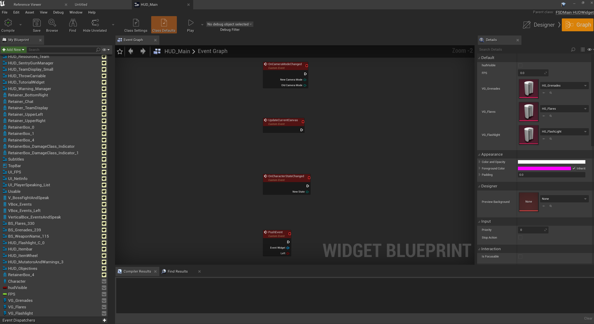
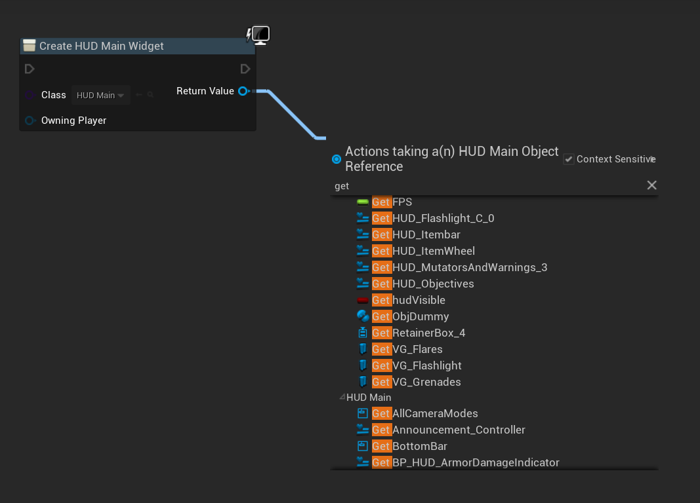
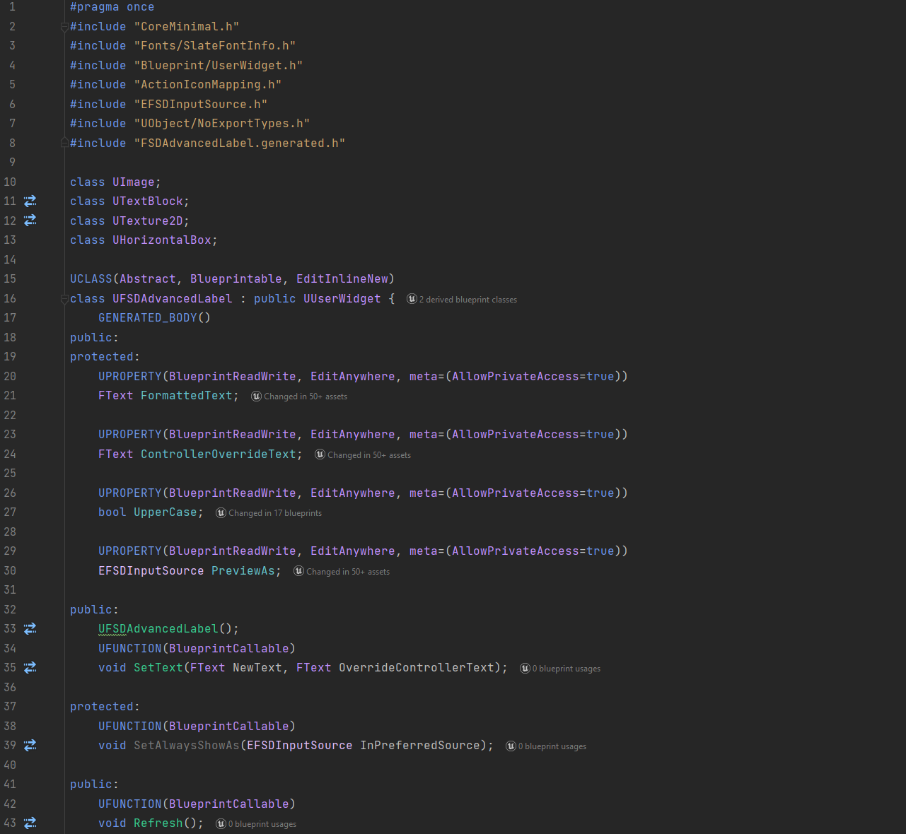
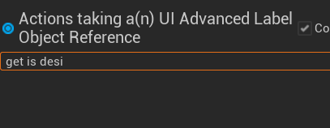
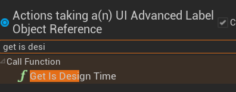

# Blueprints
Blueprint modding is the most accessible form of "advanced" modding, in that modders can create new assets and write code to produce mods that do more complex things. It also happens to be the easiest technique to directly support, which is discussed in the [Mod Support](https://buckminsterfullerene02.github.io/dev-guide/ModSupport) section. 

Blueprint mods can do everything normal UE blueprints can do, which means that at an absolute minimum, there are a lot of possibilities. There is an exception to this however – any modules of the engine that are stripped from shipping builds of games will not work when accessed by blueprint. For example, the cheat manager object is stripped by default (for obvious reasons), so any calls to the cheat manager will not work.

## References
Blueprints can get references to any asset in the game as well as any C++ exposed to blueprints. This is especially important, because references are just strings that point to the package name of an asset or exposed C++, where:
- `/Game/` is an asset inside of the Content folder, e.g., `/Game/Blueprints/BPCharacter`
- `/Script/` is a C++ class, e.g., `/Script/ACustomCharacter`

Which means that references are persistent when cooking and packaging, therefore allowing "fake" references to be made, and then when the blueprint is loaded into the game, it will reference the real, unchanged asset. 

To make the fake reference, you guessed it, modders can make the asset in the same name, location, and type as in the game and reference it in the blueprint. This is coined as "dummying." It will work, as long as they do not pack the dummied asset into the mod, otherwise it will replace the original and cause issues. 

With this concept now in mind, faking references can go much further. Modders can dummy properties, functions, delegates, components, and events inside of the dummied asset, which they can then access from their mod blueprints. The following two images show a widget that has had a few properties and events reconstructed so that they can be referenced in a mod blueprint.

*Reconstructed properties inside of a widget*

*Calling these properties by reference of this asset*

But still, this concept can be pushed even further. Can you dummy the blueprint exposed C++ headers that the game has? **Absolutely.** Every single function exposed with `UFUNCTION`, every property exposed with `UPROPERTY`, enum with `UENUM`, struct with `USTRUCT` and class with `UCLASS`, can be dummied in the project and accessed from blueprint. 

*Some header code reconstructed for a custom User Widget class*

Remember when I said that C++ classes cannot be loaded into the game using pak files, but it is not **_that_ big of a deal**? This is why. If you want modders to be able to access as much C++ in your game as possible, expose it all to blueprint! Of course, there is a minor performance impact, and compiling the game takes longer since there is more work for the Unreal Header Tool. So, there is some weighing up to do with code that you care about performance overhead for. 

Not only are your own C++ headers able to be dummied, but so are any plugins that your game uses. So, depending on which plugin options you have enabled, blueprint mods will be able to use any exposed plugin code. While it does not change any functionality, modders could choose to download the plugin’s source, if readily available, and insert it into their projects. Depending on the plugin, and what they are trying to do, they could then test any blueprint code using the plugin, in-editor, saving them from having to cook, package and test in-game. 

So, as you can see, blueprints are extremely powerful tools for creation. Any blueprint code that developers can produce, modders can also produce, if they wanted to. 

## Force reflection
But, unintuitively, modders can access more C++ in their blueprints than developers. This is because the flags that UHT definitions are purely used to control how much data is viewed in the editor. 

Let’s say that a `UFUNCTION` in the game ‘Z’ has no `BlueprintCallable` flag. In the Z's UE project, developers will not be able to find the function in the node menu. However, if modders recreate the header for Z in their own project, and give it the `BlueprintCallable` flag, they will be able to see the function. Most importantly, **the function will work in-game.** 

What is set in Z’s actual project | What modders can do in their recreated project
----------------------------------|--------------------------------------------
 | 
 | 

As a reminder, if the game has no `UFUNCTION()` macro above something (i.e, it is not reflected), then the modders will not be able to use it at all; this goes the same for any other reflection macros.

Luckily, there is a tool that dumps all the C++ headers in the game into UHT format with all their corresponding flags and generates a new UE project based off these headers. You can find the repository and wiki page for that [here](https://docs.ue4ss.com/guides/generating-uht-compatible-headers).

## How blueprints are loaded without mod support
Without official mod support, it is quite difficult to load blueprint mods. Modders are not able to simply replace any asset with a mod blueprint since it likely needs to be loaded all the time, and they would also have to reconstruct 1-1 the blueprint and its code that they replace so that the game does not crash. Unless the asset is basically empty (thus easy to reconstruct correctly), this is just not possible for most. 

So, how do they do it?

You have almost certainly heard of a mod loader. There is usually one for any community developed mod support for most games on most engines. They are not the same as a mod manager. A mod loader is as it is named – it loads mods. 

In Unreal Engine, the methods used can vary, depending on each game, their engine versions, engine modifications, etc. Here is a high-level overview of the most common methods, in order of difficulty:
- Completely replace an asset that is always loaded and does not do anything important, e.g., a credits widget in the escape menu

- Using a "game generic" [mod loader](https://docs.ue4ss.com/feature-overview/blueprint-modloader) that hooks into a common UE function using DLL injection and loads blueprint actors

- Edit an asset (using an asset editor) that is loaded at the construction of every level, e.g., a HUD widget or gamemode actor, to [kismet splice](https://github.com/trumank/kismet-analyzer) in a custom function that loads a blueprint actor that has all the mod loading code inside of it

Once any blueprint or widget has been loaded with custom code in, the mod loader can then go about loading any other mods that maybe are within a certain folder in the asset content, using normal UE [asset registry](https://docs.unrealengine.com/4.27/en-US/ProgrammingAndScripting/ProgrammingWithCPP/Assets/Registry/) functions. 

For example, a mod loader may require blueprint mods to be inside `Content/YourModName/ModActor`, inside of their UE projects before they cook & create their pak file. That way, in the mod loader's code, they can just check every subfolder in `/Game/` for the `ModActor` actor and spawn that.

As you can tell, the need for natively spawning blueprint mods is top priority. Luckily, it is quite easy, but that is explained in the "Mod support" section.
