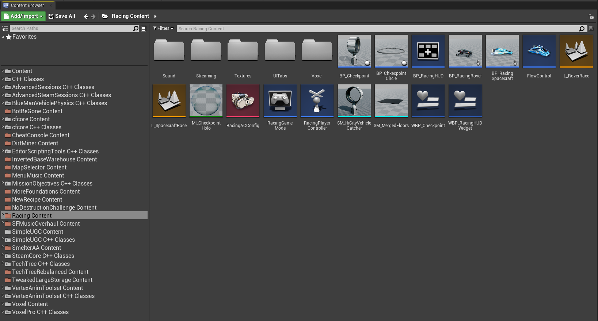
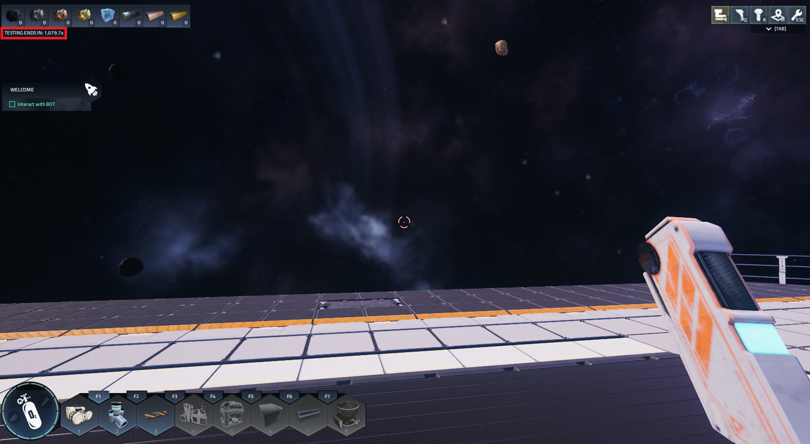
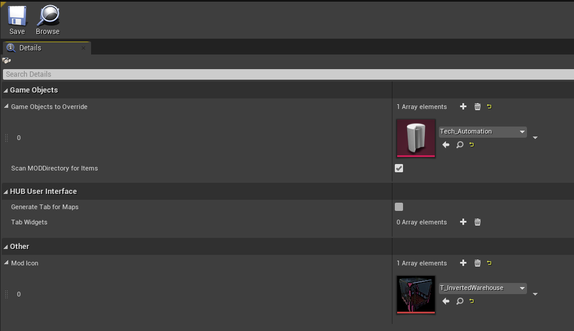
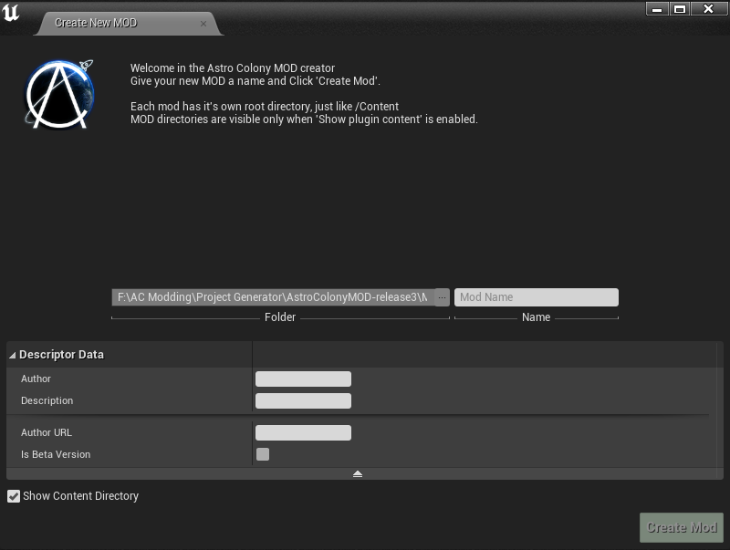
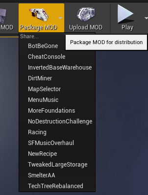
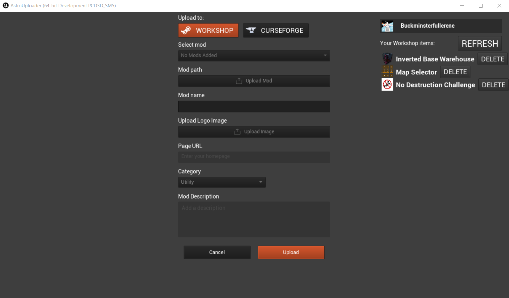

# Examples of a developer modkit

## Astro Colony

The Astro Colony official modkit (and its whole mod support) was developed following my direct advice and guidance, but also contains a few extra handy tricks up its sleeve that is worth mentioning, and has fed back into the creation of the developer modkits section of this guide (as I had not written it yet when I was advising them).

You can find the documentation for and the google drive download link for the modkit [here](https://docs.google.com/document/d/1ZDhyMEZzLPiHIUOYyHeiAVVUIPFvbwLul9WAgymHazI) (you don't need to own the game to download it, despite it having full PIE support).

The modkit uses plugin content for each mod. Here's an example of the content browser, where each mod folder is coloured beige:

## Plugins

Astro Colony contains a number of free, custom and paid plugins. One of the paid plugins is the $350 [voxel plugin pro](https://www.unrealengine.com/marketplace/en-US/product/voxel-plugin-pro). The developer asked for, and got direct permission from the developers of this plugin to ship the binaries and content with the modkit so that PIE works and mods can use the voxel assets/classes. 

## Main blueprint actor

Inside of the mod, the main initialization blueprint can be created. There are three events that modders can use to control the game in specific moments:
- Init - should be used to configure game values and adding new recipes
- BeginPlay - when interacting with game actors or spawning new actors
- EndPlay - should be used to clean up the game state when the map is closed

## PIE time limiter

The modkit has a 20 minute PIE timer per session. However you can also quicksave and quicklod the session to continue it later while debugging mods.

## Mod config file

Each mod is required to contain a mod config asset, which looks like this:

## Create mod

## Package mod

## Upload mod

