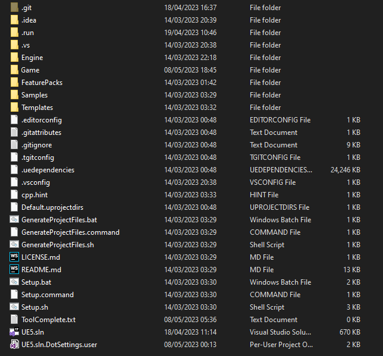
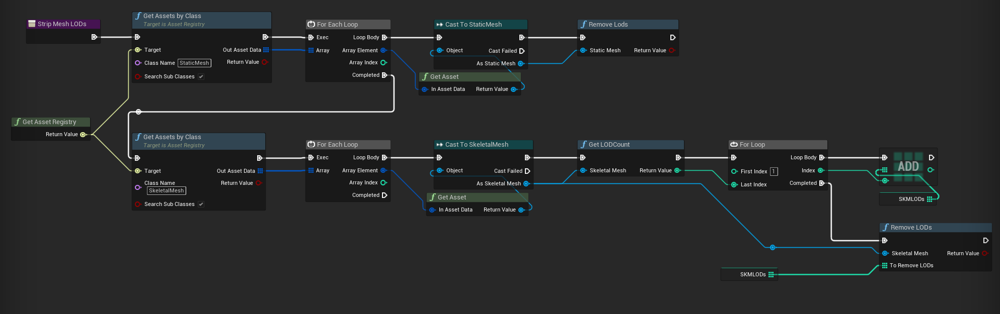

# How?

Everything I describe here can be automated fairly easily using a wrapper batch script, or [BuildGraph](https://docs.unrealengine.com/4.27/en-US/ProductionPipelines/BuildTools/AutomationTool/BuildGraph/), in order to make making new modkits simple for minor or major updates. I also recommend that you experiment with build flags to see what might work better for you.

## Building your modkit

The process of building your modkit differs depending on whether or not you are planning on building modularly and allowing modders to link against your game's modules, or if you are planning on shipping a custom engine build.

1. First, you will likely need to make a copy of your game's project, as you may end up performing optimisations to your content to keep file size down

2. Next, inside of your `.uproject` file, you must make sure that the engine version set inside it is your version (i.e. custom engine if you have one)

3. Build your project solution. This will make your binaries. You can do it in any configuration, though just the default development editor target is fine. You can also build the binaries for your server targets if you're looking at server mod support too (which I won't cover here, as I don't have experience with it)

4. After you build the editor project, you can look at keeping the file size down, which is discussed [in detail](#keeping-file-size-down)

5. Get the files and folders for your project and prepare them for distribution, according to the following table:

Project file/folder | Do you need it? | Notes  
--------------------|-----------------|------
`Binaries` | Yes | Plus PDBs if you want them
`Build` | No | If you have any automation modules that are needed for the build
`Config` | Yes | Make sure to not ship crypto/private API keys accidentally
`Content` | Yes | Base game content
`DerivedDataCache/Compressed.ddp` | No, only if you want to | Discussed [here](#compressed-ddc)
`Source/<ModuleNames>/<ProjectName>.Build.cs` | No, only if you are shipping with C++ mod support | Allows the C++ mods to link to the modules
`Source/<ModuleNames>/Public` | No, only if you are shipping with C++ mod support | Allows the C++ mods to link to the modules
`Plugins/<PluginNames>` | Yes | `.uplugin` file, content & binaries
`Plugins/<PluginNames>/Source` | No, only if you are shipping with C++ mod support | Allows the C++ mods to link to the modules
`<ProjectName>.uproject` | Yes | 

### With custom engine
If you need to ship your own custom engine, you must **additionally** perform the following steps:

1. Compile Binaries for all relevant tools (UBT, UHT, UAT, UnrealPak, ShaderCompileWorker, UnrealInsights, LiveCodingConsole, etc)

2. Get the files and folders for your engine and prepare them for distribution. This one is a bit more complicated, and requires a bit more of thoughtful includes - for a decent list you can look into Epic's own `Engine/Build/BuildGraph/InstalledBuild.xml` and related files, you need a roughly similar list of files. But at a bare minimum, you need:

Engine file/folder | Do you need it? | Notes
--------------------|-----------------|------
`Binaries` | Yes | Binaries for the relevant tools (UBT, UHT, UAT, UnrealPak etc.), the editor and the game
`Build` | Yes | Batch scripts and other things necessary for working with the engine distribution
`Config` | Yes | Default engine config files
`Content` | Yes | All of it
`Source` | Yes | Engine sources, target files etc.
`Sources` | Yes | Engine shader source files
`Plugins` | Yes | Only the plugins that your project uses
`GenerateProjectFiles scripts` | Yes | You also want scripts like this in the root of the engine distribution

Here's an example of what your directory might look like by the end (minus bits and bobs that you don't need):

## Keeping file size down

If your modkit is huge (i.e. you have massive amounts of content), you can look at trying a few different ways to keep your filesize down:
- Reducing texture quality
- Removing all mesh LODs except LOD 0 from meshes
- Packing the whole content folder into a `.pak` file and loading the editor to use the pak file
- Stripping your PDBs using PDBSTRIP
- Priming the DDC with a compressed DDC file

### Removing LODs

Modders do not typically need multiple LODs on meshes, unless you forsee them doing map modding, in which case it may be beneficial to have these to keep the editor map performant. 

In the editor, you can remove all LODs except LOD 0 (the base LOD) from static meshes and skeletal meshes; this can be done using an asset editor utility script or similar, for example:

### Reducing texture quality

In the editor, you can increase the LOD bias of a texture in order to reduce the quality of it, thus its filesize. In order to do this in bulk, you can use the bulk editor matrix asset action, or some automation script of your own, or use the pre-existing plugin [rdTexTools](https://www.unrealengine.com/marketplace/en-US/product/rdtextools).

### Packing content folder

Instead of distributing your game's content as loose `.uasset`/`.uexp` files, you might want to use UnrealPak to package them into a single file instead. This has a few benefits:
- If you're using World Partition, the amount of loose files it generates is ridiculous and is definitely not fit to be handled by distribution fronts, so paking it all up is a must-have for you

- You can compress the resulting pak file with LZ4 or other compression algorithm. In a couple of cases, it has over halved the content size

It **must** be mentioned that this method only works if:
- You are distributing your custom engine with the modkit

- You are not distributing a custom engine version, but you force the modkit files to be placed in the same directory as the files of the engine version your game is using

The reason for this is how the project pak file is mounted. Pak file paths are relative to the base directory, i.e. the one with the executable in it. For the editor, that is the engine binaries directory, so to use paks you need to have the project at a predictable relative path to the engine - usually right next to the Engine directory to mirror the structure of a shipped game. However, you *can* set the mount point of the pak to some relative path away from the engine, but obviously if each user is putting their modkit projects at different paths, you can't dynamically set the mount point. The whole point of this is to avoid distributing a large number of loose files, so if users are having to do this based on where they put their project, it defeats the whole purpose.

You can do the same for engine content as well to reduce the distribution size and loose file count, but you need to put it into the separate pak file and not your Project Pak, as engine content is used by the tools/programs that do not read project paks.

The editor requires the `-UsePaks` command line switch to use pak files by default, but it's a 1-line engine patch to change the default behavior, so you may as well do that if you're shipping with a custom engine. Otherwise, you'll need to instruct your users to run the editor with a batch script or similar, that includes this flag.

**Paking your game content will prevent people from modifying it** - while they will still be able to see and work with it in the editor, they wouldn't be able to save changes to the file system - but generally, you don't really want modders to be modifying your base game content anyway.

### Stripping your PDBs

If you're intending to ship the SDK with PDB debug files, it's generally a good idea to strip them using PDBSTRIP first. This is a tool that comes with Windows, and it's usually located in `C:\Program Files (x86)\Windows Kits\10\Debuggers\x64\srcsrv\pdbstr.exe`.

It reduces the size of the PDB files by a magnitude of 100, making them as small as the resulting binaries.

However, some information from the PDB files, like private symbol names, are lost, but you can't really distribute the non-stripped PDBs because take so much space for multiple targets in multiple configurations.

### Compressed DDC

When a user first opens the modkit project, they will likely have tens of thousands of shaders to compile. For some with lower end PCs, this can take many hours. However, you can get around this by providing a compressed [derived data cache](https://docs.unrealengine.com/4.26/en-US/ProductionPipelines/DerivedDataCache/) file that contains all of the data for precompiled shaders, and additionally makes cooking the content way faster. 

The following command can be used to create a compressed DDC file:
`UE4Editor.exe ProjectName -run=DerivedDataCache -fill -DDC=CreateInstalledProjectPak`

It is recommended that you use `CreateInstalledProjectPak` instead of the default `CreatePak` as it is a "compressed" version of the normal DDC pak and is roughly half the size.

The editor will automatically pick up your `Compressed.ddp` file if it is in the directory `ProjectName/DerivedDataCache/`.

The default configuration settings under `[DerivedDataBackendGraph]` in `DefaultEngine.ini` in the project's config settings are good to use as is.

## Where mods go (in the project)

Ideally, when a new mod is created in a modkit, it is created as plugin content (or a C++ plugin with content if you are supporting C++ modding). 

This offers the most flexible way of managing mods within the editor, as you can easily package them seperately from the main game content. Additionally, when distributing updated versions of the modkit's content, you won't have to worry about overwriting any mod content.

If you are using a pak file for your content, you have to do this, otherwise mods in the ProjectName/Content/ directory will not be recognised by the editor.

Then, inside each mod, you have any required files responsible for loading the mod, such as the initialization blueprint that the mod loader checks for and spawns, or the mod config file, which will be further discussed in the [extra features](ExtraFeatures.md#mod-configuration-files) section.

## Updating modkit versions

There are a few solutions you may consider when it comes to updating your modkit versions:
- Provide a whole new modkit download every version. This isn't optimal due to the size on disk, and modders having to always migrate their mod content to a new project, which in some cases can be somewhat painful

- If your modkit is project only, then using a seperate Steam/EGS install could work best as they already contain the utilities needed to patch only the modkit files that have changed 

- If your modkit is project + engine, then you may have to come up with your own solution that combines the engine source being on your custom engine Github fork, the engine dependencies being pulled from your servers using the git dependencies file, and the project files being pulled from elsewhere, and then potentially introducing a patching system onto all of that

- If you can, negotiate with Epic to allow engine distribution to happen on Steam and/or EGS as a seperate app (this is what the Satisfactory official modkit does)