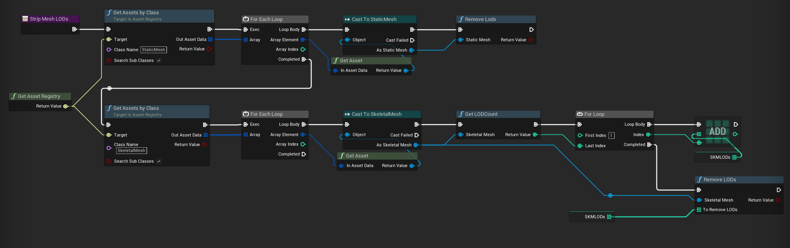

# How to create an editor modkit

As before, there are two choices of editor modkit; uncooked editor and cooked editor.

**Before reading this page, please read up on the page for explaining engine changes necessary for enabling cooked editor.**

[Cooked editor engine changes](CookedEngine.md)

## Building editor and engine (if applicable) for distribution

Everything I describe here can be automated fairly easily using a wrapper batch script, or BuildGraph, in order to make making new modkits simple for minor or major updates. I also recommend that you experiment with build flags to see what might work better for you.

### Building the editor

The process of building your editor differs depending on whether or not you are planning on building modularly and allowing modders to link against your game's modules, or if you are planning on shipping a custom engine build.

1. First, you will likely need to make a copy of your game's project, as you will be making changes to configs and content (only partial content if cooked editor, methods to keep file size down if uncooked editor)

2. Next, inside of your `.uproject` file, you must make sure that the engine version set inside it is your version (i.e. custom engine if you have one)

3. Build your project solution. This will make your binaries. You can do it in any configuration, though just the default development editor target is fine. You can also build the binaries for your server targets if you're looking at server mod support too (which I won't cover here, as I don't have experience with it)

4. After you build the editor project, you can look at keeping the file size down, which is discussed [in detail](#keeping-file-size-down)

5. Get the files and folders for your project and prepare them for distribution, according to the following table:

Project file/folder | Do you need it? | Notes  
--------------------|-----------------|------
`Binaries` | Yes | Plus PDBs if you want them
`Build` | No | If you have any automation modules that are needed for the build
`Config` | Yes | Make sure to not ship crypto/private API keys accidentally
`Content` | Yes | Base game content (uncooked editor) or selected loose files (cooked editor)
`DerivedDataCache/Compressed.ddp` | No, only required for uncooked editor and you want to include it | Discussed [here](#compressed-ddc)
`Source/<ModuleNames>/<ProjectName>.Build.cs` | No, only if you are shipping with C++ mod support | Allows the C++ mods to link to the modules
`Source/<ModuleNames>/Public` | No, only if you are shipping with C++ mod support | Allows the C++ mods to link to the modules
`Plugins/<PluginNames>` | Yes | `.uplugin` file, content & binaries
`Plugins/<PluginNames>/Source` | No, only if you are shipping with C++ mod support | Allows the C++ mods to link to the modules
`<ProjectName>.uproject` | Yes | 

### Building your custom engine

If you need to ship your own custom engine, you must **additionally** perform the following steps:

1. Compile Binaries for all relevant tools (UBT, UHT, UAT, UnrealPak, ShaderCompileWorker, UnrealInsights, LiveCodingConsole, etc)

2. Create an installed engine build. Get the files and folders for your engine and prepare them for distribution. This one is a bit more complicated, and requires a bit more of thoughtful includes - for a decent list you can look into `Engine/Build/BuildGraph/InstalledBuild.xml` and related files, you need a roughly similar list of files. But at a bare minimum, you need:

Engine file/folder | Do you need it? | Notes
--------------------|-----------------|------
`Binaries` | Yes | Binaries for the relevant tools (UBT, UHT, UAT, UnrealPak etc.), the editor and the game
`Build` | Yes | Batch scripts and other things necessary for working with the engine distribution
`Config` | Yes | Default engine config files
`Content` | Yes | All of it
`Source` | Yes | Engine sources, target files etc.
`Sources` | Yes | Engine shader source files
`Plugins` | Yes | Only the plugins that your project uses
`GenerateProjectFiles scripts` | No | Installed engine build is not designed to be built from source

You should build the engine for all target platforms - at minimum for Win64. If you a cross platform game and you wish to allow mods to be packaged for consoles, then you will need to allow modders to do cloud cooking on your own servers. 

## Where mods go (in the project)

Ideally, when a new mod is created in a modkit, it is created as a content only plugin (or a C++ plugin with content if you are supporting C++ modding). 

If you are using gameplay feature plugins, consider making mods as those plugins for even more flexibility.

If you are using data driven gameplay and are using the asset registry scanning techniques, mods as plugins can then place their own data assets into the directories matching the game's. The engine will automatically mount the plugin's asset registry and merge it into the game's one, meaning that any asset registry scans of directories or assets of parent class will automatically pick up those from mods without any extra work from the game.

This offers the most flexible way of managing mods within the editor, as you can easily package them seperately from the main game content. Additionally, when distributing updated versions of the modkit's content, you won't have to worry about overwriting any mod content.

Then, inside each mod, you have any required files responsible for loading the mod, such as the initialization blueprint that the mod loader checks for and spawns, or the mod config file, which will be further discussed in the [extra features](ExtraFeatures.md#mod-configuration-files) section.

## Editor configs

Aside from copying over your project configs (minus those contianing sensitive info), there are some additional configs you need to know about when setting up the editor.

### Packaging configs

When the mod is cooked and packaged, UE will automatically also try to cook any game assets that the mod references, all the way up the dependency tree. Since game content should never be cooked, you need to add all game and game's plugins content folders to the `DirectoriesToNeverCook` config. In UE5+, you need to set `CookContentMissingSeverity` to `Warning` so that the cook does not fail due to not being able to cook dependencies.

### Cooked editor configs

If using cooked editor, you additionally need to set `ZeroEngineVersionWarning=False`, `cook.AllowCookedDataInEditorBuilds=True` & `s.AllowUnversionedContentInEditor=1`.

## Stripping PDBs

If you're intending to ship the engine or editor with PDB files, it's generally a good idea to strip them using PDBSTRIP first. This is a tool that comes with Windows, and it's usually located in `C:\Program Files (x86)\Windows Kits\10\Debuggers\x64\srcsrv\pdbstr.exe`.

It reduces the size of the PDB files by a magnitude of 100, making them as small as the resulting binaries.

However, some information from the PDB files, like private symbol names, are lost, but you can't really distribute the non-stripped PDBs because take so much space for multiple targets in multiple configurations.

## Reducing editor size & QoL (uncooked editor only)

If your uncooked modkit is huge (i.e. you have massive amounts of content), you can look at trying a few different ways to keep your filesize down:
- Reducing texture quality
- Removing all mesh LODs except LOD 0 from meshes

Also, just like you (probably) have in your team's build systems, you should consider priming the DDC with a compressed DDC file and distribute that alongside the editor.

### Removing LODs

Modders do not typically need multiple LODs on meshes, unless you forsee them doing map modding, in which case it may be beneficial to have these to keep the editor map performant. 

In the editor, you can remove all LODs except LOD 0 (the base LOD) from static meshes and skeletal meshes; this can be done using an asset editor utility script or similar, for example:

### Reducing texture quality

In the editor, you can increase the LOD bias of a texture in order to reduce the quality of it, thus its filesize. In order to do this in bulk, you can use the bulk editor matrix asset action, or some automation script of your own, or use the pre-existing plugin [rdTexTools](https://www.unrealengine.com/marketplace/en-US/product/rdtextools).

### Compressed DDC

When a user first opens the modkit project, they will likely have tens of thousands of shaders to compile. For some with lower end PCs, this can take many hours. However, you can get around this by providing a compressed [derived data cache](https://docs.unrealengine.com/4.26/en-US/ProductionPipelines/DerivedDataCache/) file that contains all of the data for precompiled shaders, and additionally makes cooking the content way faster. 

The following command can be used to create a compressed DDC file:
`UE4Editor.exe ProjectName -run=DerivedDataCache -fill -DDC=CreateInstalledProjectPak`

It is recommended that you use `CreateInstalledProjectPak` instead of the default `CreatePak` as it is a "compressed" version of the normal DDC pak and is roughly half the size.

The editor will automatically pick up your `Compressed.ddp` file if it is in the directory `ProjectName/DerivedDataCache/`.

The default configuration settings under `[DerivedDataBackendGraph]` in `DefaultEngine.ini` in the project's config settings are good to use as is.

## Gameplay tags

If your project uses gameplay tags, you'll likely have tags defined in `Config/DefaultTags.ini` or in specific `ini` files in `Config/Tags` - but you may also have tags defined natively (in C++) or in assets.

If you are distributing with your compiled source, the natively defined tags are handled - the editor will pick these up automatically.

If you are using uncooked editor, the gameplay tags defined in your content will also be picked up automatically when it loads all the packages at startup.

However, if you are using cooked editor, the gameplay tags defined in your content will *not* be picked up automatically, as it cannot read the tags from the cooked files when they are loaded in. This will cause a significant problem if you are using gameplay tags extensively, as those defined in content simply will not be available for use/viewing by mods.

The solution to this will be up to you - perhaps you already have a spreadsheet or document listing all gameplay tags that you can add to your project via config files (it's fine to have duplicate entries from different sources, the engine handles this fine). 

For Subnautica 2 cooked editor, I wrote an extension to the tooling that [generates the UHT class schema](https://github.com/Subnautica2Modding/Subnautica2-Project/blob/sn2-engine-v0.10.3/Plugins/Suzie/Source/Suzie/Private/SuzieGameplayTags.cpp) at startup to [harvest all gameplay tags from the game content](https://github.com/Buckminsterfullerene02/meatloaf/blob/5bc964b498c801c4b40bc484721ef10a4a1761b5/jmap_dumper/src/lib.rs#L1019) and then register those gameplay tags to the project at startup. 

## Updating modkit versions

There are a few solutions you may consider when it comes to updating your modkit versions:
- Provide a whole new modkit download every version. This isn't optimal due to the size on disk, and modders having to always migrate their mod content to a new project, which in some cases can be somewhat painful

- If your modkit is project only, then using a seperate Steam/EGS install could work best as they already contain the utilities needed to patch only the modkit files that have changed 

- If your modkit is project + engine, then you may have to come up with your own solution that combines the engine source being on your custom engine Github fork, the engine dependencies being pulled from your servers using the git dependencies file, and the project files being pulled from git, which is able to deal with project files fine, except for game content (if using uncooked editor) which may have to be downloaded seperately. Or use lotus, Epic Games' answer to perforce? Since it's open source, it could be interesting to use.

- If you can, negotiate with Epic to allow engine distribution to happen on Steam and/or EGS as a seperate app
