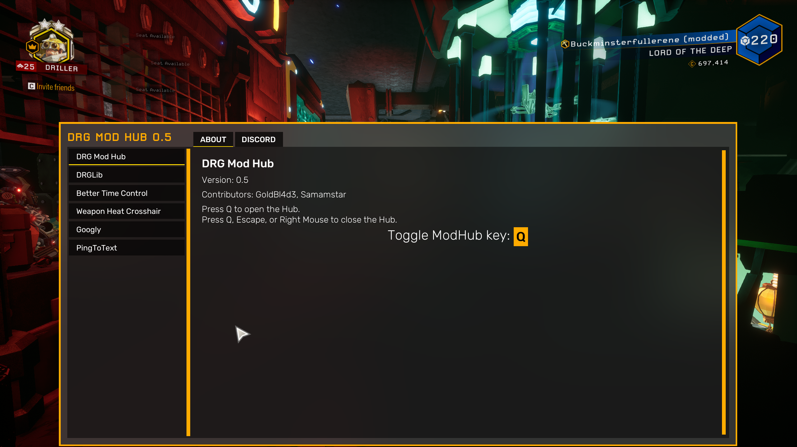
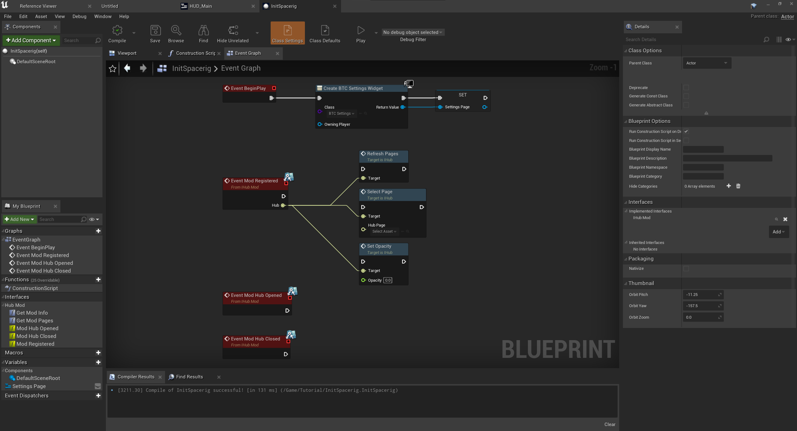

# Mod managers
Arguably, having a good system for users being able to manage mods is just as important as having good mod support systems. 

There are 2 main components of mod managers; the part within the game itself that lets users view their subscribed mods and toggle them on/off, and then the 3rd party webserver that users subscribe/browse mods on. 

The integration can vary greatly depending on the game and there is no one “preferred” method by modders so there is not much to advise upon. I suggest you just do your own research since there is a lot of material and help available around already.

## Mod browsing

While both parts could be integrated into within the game and managed by your studio's own servers, most games stick with keeping the mod browsing to a 3rd party system. 

The most common systems used are Steam Workshop, mod.io and Nexus, although the latter is not recommended for official mod support, since content is moderated not by developers, but by Nexus staff. 

Personally, I really like mod.io because they do a lot of the heavy lifting with moderation tools, a strong API and flexibility for every game, even if they’ve had a rocky last few months with their v2 website.

## Managing mods in-game
Typically, games will have a subcategory in the main menu for managing mods. In this window, the game should display subscribed and/or downloaded mods with their name, description, thumbnail, author and version pulled from either webserver API or a descriptor file within the mod download.

## Providing a shared mod settings window
Something that many games do not have however, is a “shared settings window” for mods. If a blueprint mod wants to be able to get user input with widgets such as buttons, sliders and text boxes, they need to figure out how to create their own widgets and manage the mouse cursor, layering, controls, etc. But if a game can provide a central widget for mods to interface with, settings for each mod can be placed in one shared window that makes sense. Since it is part of the game, developers can make the window fit the style of the game, and work seamlessly with their other menus.

A solid way to implement a system like this is to provide a collection of interfaces in a folder that could be part of your mod kit, if you have one. Modders can interface their blueprint mods and settings widgets with these interfaces, which once in-game, reference the actual management code for placing the settings widgets into the menu.

Here’s an example of a shared mod settings window that modders created for the game Deep Rock Galactic:

*In-game menu for mods*

*An example mod using the mod hub's interfaces*

I’ve ported this to be game-generic, which means that any modding community can take the source code and edit it slightly to work with whatever mod loading method they are using. You can find the link to its source [here](https://github.com/AstroColony-Modding/Mod-Hub), if you wish to see how exactly it works.
