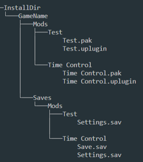

# Folder hierarchy
Obviously, you need to be able to assign mod actors to mod names/IDs, so a good folder hierarchy is important. My suggestion is that you put a Mods/ folder inside of `<GameInstallFolder>/<GameName>/` and then inside of that, split up each mod by a folder with the name of the mod. Inside of that folder is the mod files, including the “Init” blueprint actors that you are scanning for to load. 

If you know your game will upgrade to new engine versions and/or make significant code changes in the future, it may be in your best interest to have that includes mod information within it. With this I mean, you could require a "descriptor” .txt/.uplugin file in the mod folder name to inform the game version that it currently works on. 

Then your mod mounting system can include reading that for detecting whether a loaded mod will have compatibility with the current version, the mod author, mod version, mod description, etc. All things that you can show in the mod browser in the game. If your game already calls this data from an API when it downloads subscribed mods on a 3rd party site, then you can ignore this step. If you decide to use a system like this, make sure that you communicate what is required with the modders!

Finally, you may want a dedicated location for mod saves to be stored. Since modders have access to the same “save object to file” blueprint node that you have – where the root directory is `<GameName>/Saves/` - you can’t really control within that folder they go, unless you write your own function for that. Since you should be communicating everything to your modders anyway, you may choose to require that mod saves are stored in `<GameName>/Saves/Mods/<ModName>/` although there still isn’t anything stopping modders from not conforming to that. Unless your game is doing something special, it shouldn’t matter if mod saves are all mixed up in one directory.

To put all this together, let’s run through an example. Say there are two mods installed. The mod hierarchy could look like this:



*Example mod folder hierarchy*

Unless you have changed it, your `Saves/` folder will be in `%appdata%/Local/<GameName>`, which of course is also fine. In this example I have chosen to change the Saves folder to the game install location, which some games do.

In this example I have chosen to use a .uplugin file to store the mod information. You may prefer this, as the format of the `.uplugin` is JSON which means that a template can be provided for modders to use. Importantly, it almost eliminates the risk of mistakes in the file since it is obvious where information goes. I reiterate that it is indefinitely vital to remove potential points of failure for the lowest bar possible. An example of this could be:

```
{
    "ModName": "Time Control",
    "Description": "Allows the user to control the global time dilation.",
    "Category": "Gameplay",
    "CreatedBy": "Buckminsterfullerene",
    "ThumbnailImage": "https://3rdartymodmanger.com/GameName/mods/Time%20Control/Thumbnail.png",
    "GameVersion": "1.37",
    "ModVersion": "1.0",
    "Dependencies": 
    [
        {
            "ModName": "ModLib",
            "ModURL": "https://3rdartymodmanger.com/GameName/mods/ModLib",
        }
    ]
}
```